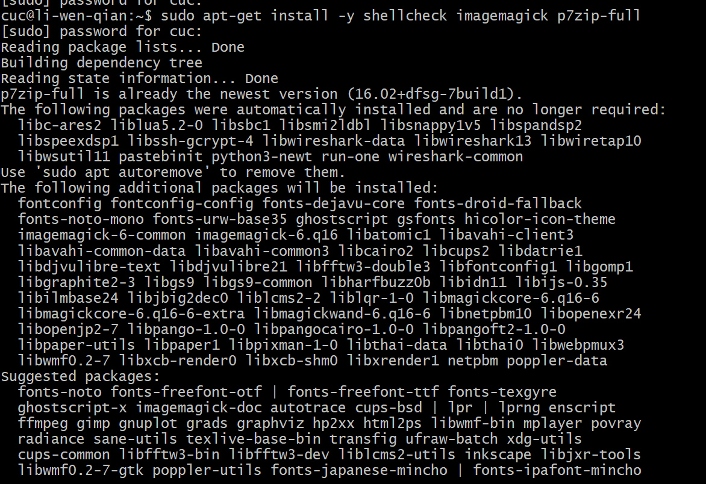
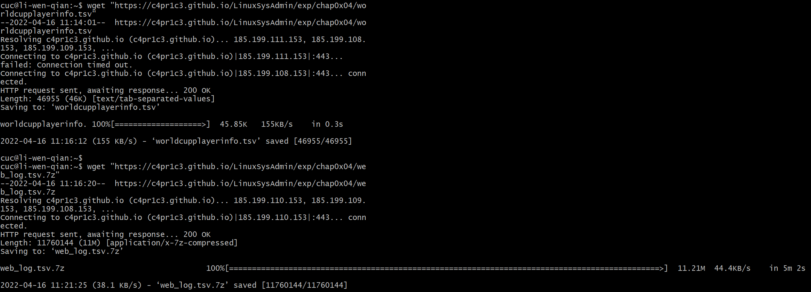
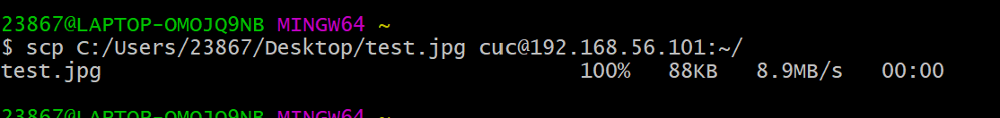
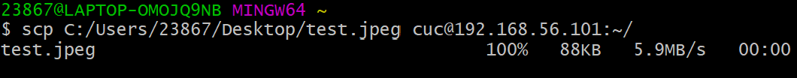
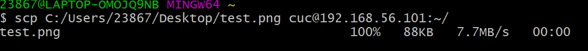
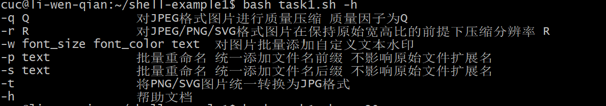
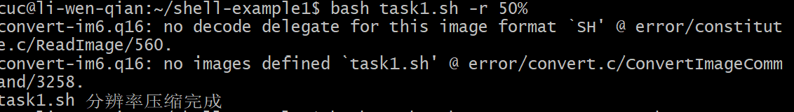
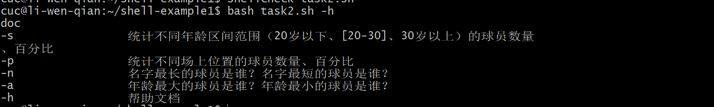
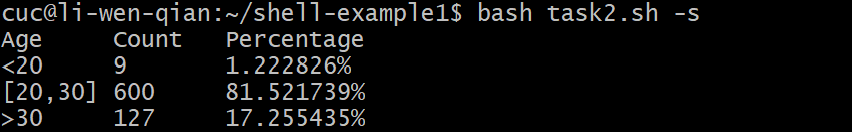

# 第四章：shell脚本编程基础（实验）

### 实验环境：

-Ubentu 20.04

-Travis

### 实验内容：

#### 任务一：用bash编写一个图片批处理脚本，实现以下功能：

- [x] 支持命令行参数方式使用不同功能

- [x] 支持对指定目录下所有支持格式的图片文件进行批处理

- [x] 支持以下常见图片批处理功能的单独使用或组合使用
  - [x] 支持对jpeg格式图片进行图片质量压缩 -q
  - [x] 支持对jpeg/png/svg格式图片在保持原始宽高比的前提下压缩分辨率-r
  - [x] 支持对图片批量添加自定义文本水印-w
  - [x] 支持批量重命名（统一添加文件名前缀或后缀，不影响原始文件扩展名）-p
  - [x] 支持将png/svg图片统一转换为jpg格式图片-t

  **实验过程：**

  1. 安装imagemagick、shellcheck和p7zip
  ```sudo apt-get update 
  sudo apt-get install -y shellcheck imagemagick p7zip-full
  ```

  ```
  - wget "https://c4pr1c3.github.io/LinuxSysAdmin/exp/chap0x04/worldcupplayerinfo.tsv"
  - wget "https://c4pr1c3.github.io/LinuxSysAdmin/exp/chap0x04/web_log.tsv.7z"
  ```

  

  

  2. 将图片文件上传到Linux

     ```
     scp C:/Users/23867/Desktop/test.jpg cuc@192.168.56.101:~/
     ```

     

     

     

  3. 编辑脚本

  4. 本地测试

  

  

  

  （jpeg,png格式图片有一点问题，-q,-w,-p,-s,-t,-h输入命令后无响应）

     5.编写`.travis.yml`文件后上传至GitHub测试

#### 任务二(1)：用bash编写一个文本批处理脚本，对以下附件分别进行批量处理完成相应的数据统计任务：

- 2014世界杯运动员数据
  - [x] 统计不同年龄区间范围（20岁以下、[20-30]、30岁以上）的球员**数量**、**百分比**
  - [x] 统计不同场上位置的球员**数量**、**百分比**
  - [x] 名字最长的球员是谁？名字最短的球员是谁？
  - [x] 年龄最大的球员是谁？年龄最小的球员是谁？

  **实验过程：**

     1.下载[2014世界杯运动员数据](https://c4pr1c3.github.io/LinuxSysAdmin/exp/chap0x04/worldcupplayerinfo.tsv)到本地

   \```wget "https://c4pr1c3.gitee.io/linuxsysadmin/exp/chap0x04/worldcupplayerinfo.tsv"```

  ​     2.编辑脚本

  ​     3.本地测试

  

  

  

  

  ​      4.编写`.travis.yml`文件后上传至GitHub测试


#### 任务二（2）：用bash编写一个文本批处理脚本，对以下附件分别进行批量处理完成相应的数据统计任务：

- Web服务器访问日志
  - [x] 统计访问来源主机TOP 100和分别对应出现的总次数
  - [x] 统计访问来源主机TOP 100 IP和分别对应出现的总次数
  - [x] 统计最频繁被访问的URL TOP 100
  - [x] 统计不同响应状态码的出现次数和对应百分比
  - [x] 分别统计不同4XX状态码对应的TOP 10 URL和对应出现的总次数
  - [x] 给定URL输出TOP 100访问来源主机
  
  **实验过程：**
  
     1.下载[Web服务器访问日志](https://c4pr1c3.github.io/LinuxSysAdmin/exp/chap0x04/web_log.tsv.7z)到本地
  
     2.解压`Web服务器访问日志.tsv`文件
  
  3. 编辑脚本
  4. 本地测试
  5. 编写`.travis.yml`文件后上传至GitHub测试
  
  **Travis：**
  
  Travis部署结果

## 实验报告总结

**遇到的问题**：

1.使用scp将图片文件上传到Linux传输报错

检查了一下发现是把`/`打成了`\`，在目录其中的为`/`，注意方向。

一下为正确格式：

```
scp C:/Users/23867/Desktop/test.jpg cuc@192.168.56.101:~/
```

2.转换图像格式方法：

如：将jpeg格式转成png格式：convert xxx.jpg xxx.png  

参考：[转换图像格式](https://blog.csdn.net/qq_42303254/article/details/89528165)

3.ImageMagickd的使用

参考：[ImageMagickd](http://www.imagemagick.com.cn/commands.html)


**代码编写参考**：

[Chap0x04实验报告提交 by Annna777  (github.com)](https://github.com/CUCCS/2021-linux-public-Annna777/pull/4/commits/e2ecc4acfc8f0ba9e280003e65c08e3f02b7d433)

[ch0x04实验报告by LyuLumos]([Ch0x04 by LyuLumos · Pull Request #6 · CUCCS/linux-2020-LyuLumos (github.com)](https://github.com/CUCCS/linux-2020-LyuLumos/pull/6/commits/e4fd988f578222ab80af331641934d76a363ab31))

[黄大课件和视频](https://c4pr1c3.github.io/LinuxSysAdmin/)

[awk命令](https://www.runoob.com/linux/linux-comm-awk.html)

[Linux 系统与网络管理视频](https://www.bilibili.com/video/BV1Hb4y1R7FE?p=79)